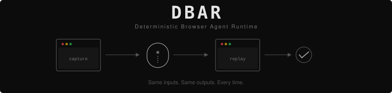

<p align="center">
  
</p>

<p align="center">
  <a href="https://www.npmjs.com/package/@pyyush/dbar"></a>
  <a href="https://pypi.org/project/dbar/"></a>
  <a href="https://github.com/pyyush/dbar/actions/workflows/ci.yml"></a>
  <a href="https://github.com/pyyush/dbar/blob/main/LICENSE"></a>
  
  
</p>

**Replayable proof for production browser agents.**

DBAR turns a browser run into a portable **capsule** you can replay, verify, and keep as a regression artifact.

If a browser workflow flakes in CI or fails in production, DBAR helps you answer:

- What actually happened?
- Can I replay it?
- Where did it diverge first?

DBAR is for teams that need more than logs, screenshots, or trace playback. It captures deterministic time, recorded network, and hashed page state so the run itself becomes an artifact.

## Choose Your Lane

| Lane | Use this when | What you get | Docs |
|------|---------------|--------------|------|
| Playwright SDK | DBAR owns the browser session directly | Full deterministic capture, replay, and first-divergence detection | This README |
| `browser-use` integration | Your workflow already runs in `browser-use` and you need step-level evidence | First-class snapshot, diff, and audit-trail lane for Python/browser-use flows (`browser-use` 0.12.5) | [python/README.md](./python/README.md), [integrations/browser-use/README.md](./integrations/browser-use/README.md) |
| Browserbase integration | You want DBAR to own a Browserbase-hosted browser session | First-class cloud capture and local replay lane with full deterministic DBAR controls (`@browserbasehq/sdk` 2.9.0) | [integrations/browserbase/README.md](./integrations/browserbase/README.md) |

## Install

For deterministic capture and replay with Playwright:

```bash
npm install @pyyush/dbar playwright-core
```

For evidence capsules with `browser-use` on Python:

```bash
pip install "dbar[browser-use]"
```

Use the npm package for the full replay engine. Use the PyPI package when your
workflow already lives in `browser-use` and you want low-friction recording and
diffing.
The `browser-use` extra is pinned to `browser-use==0.12.5` and requires
Python 3.11+.

For Browserbase-hosted deterministic capture and local replay:

```bash
cd integrations/browserbase
npm install
```

## Why Use DBAR

- **Prove what a browser agent did** with a machine-checkable artifact
- **Reproduce flaky failures** without guessing from logs
- **Pinpoint the first divergence** instead of diffing a whole run manually
- **Turn failed runs into regression fixtures** you can keep and replay later
- **Share one artifact across engineering, support, and audit**

## Integrations

- [browser-use integration](./integrations/browser-use/README.md): official DBAR integration for Python/browser-use workflows. Use it when you need step snapshots, diffs, and a durable audit trail without taking over browser ownership.
- [Browserbase integration](./integrations/browserbase/README.md): official DBAR integration for Browserbase-managed sessions. Use it when you want full deterministic capture and replay in a cloud browser lane.

## 60-Second Example

```ts
import { chromium } from "playwright-core";
import { DBAR, serializeCapsuleArchive } from "@pyyush/dbar";

const browser = await chromium.launch();
const page = await browser.newPage();
await page.goto("https://example.com");

const session = await DBAR.capture(page);

await session.step("loaded");
await page.click("a");
await session.step("after-click");

const archive = await session.finish();
const capsule = serializeCapsuleArchive(archive);
```

Replay it later:

```ts
import { DBAR, deserializeCapsuleArchive } from "@pyyush/dbar";

const archive = deserializeCapsuleArchive(capsule);
const result = await DBAR.replay(page, archive);

result.success;
result.replaySuccessRate;
result.timeToDivergence;
result.divergences;
```

## Why DBAR Instead of Traces or Session Replay

Most tools help you **observe** a browser run after the fact.

- Logs show what your code thought it did
- Screenshots show isolated moments
- Trace viewers help inspect execution
- Session replay tools show a recording

DBAR adds **verification**:

- Captures the run as a portable capsule
- Replays under deterministic controls
- Compares strict observables at each step
- Reports the first divergence with a durable artifact you can keep

If you need proof, replay, and reusable failure artifacts, DBAR is the right layer.

## What Is In A Capsule

```
capsule.json                         Manifest — environment, seeds, steps, metrics
network/<sha256>                     Deduplicated response bodies
snapshots/<step>/dom.json            Full DOM snapshot
snapshots/<step>/accessibility.json  Accessibility tree
snapshots/<step>/screenshot.png      Visual screenshot
```

Everything needed to replay the session is inside the archive.

## How It Works

DBAR controls three sources of nondeterminism at the CDP level:

**1. Time**

Virtual time via `Emulation.setVirtualTimePolicy` makes `Date.now()`, timers, and animation frames deterministic.

**2. Network**

Requests and responses are recorded through the `Fetch` domain. On replay, responses are served from the capsule using `(requestHash, occurrenceIndex)` matching.

**3. State**

At each step boundary, DBAR captures the DOM snapshot, accessibility tree, and screenshot. Replay compares the live values against the recorded hashes.

## Strict vs Advisory Observables

| Observable | Strictness | What it proves |
|-----------|-----------|----------------|
| DOM snapshot hash | **Strict** | Page structure is identical |
| Accessibility tree hash | **Strict** | Semantic content is identical |
| Network digest | **Strict** | Same requests got same responses |
| Screenshot hash | Advisory | Visual appearance only |

A replay passes when the strict observables match. Screenshot differences are reported, but do not fail the replay.

## Replay Metrics

Every replay reports:

- **RSR** — Replay Success Rate
- **DVR** — Determinism Violation Rate
- **TTD** — Time to Divergence

Those three numbers let you measure whether a workflow is reproducible and where it stopped being reproducible.

## From Failed Run To Regression Artifact

DBAR should fit the incident loop, not sit beside it.

Capture on failure:

```ts
import { writeFile } from "node:fs/promises";
import { DBAR, serializeCapsuleArchive } from "@pyyush/dbar";

const session = await DBAR.capture(page);
let failed = false;

try {
  await page.goto("https://example.com/checkout");
  await session.step("checkout-loaded");
  await page.click('[data-test=\"submit-order\"]');
  await session.step("submit-clicked");
} catch (error) {
  failed = true;
  throw error;
} finally {
  const archive = await session.finish();
  if (failed) {
    await writeFile(
      "./artifacts/checkout-failure.capsule",
      serializeCapsuleArchive(archive),
      "utf8",
    );
  }
}
```

Replay it later in CI or incident review:

```bash
npx dbar validate ./artifacts/checkout-failure.capsule
npx dbar replay ./artifacts/checkout-failure.capsule --json
```

- `dbar replay` exits with code `1` when a blocking divergence is found
- `--json` includes `timeToDivergence`, `firstDivergence`, `firstBlockingDivergence`, and the full divergence list
- screenshot-only mismatches stay advisory, so cosmetic drift does not fail the replay

## Who It Is For

- Browser agent teams shipping production workflows
- Browser automation teams fighting flaky CI and hard-to-reproduce failures
- Platform and reliability teams that need a standard artifact for browser incidents
- Audit-sensitive workflows where evidence matters after execution

## Core API

### Capture

```ts
const session = await DBAR.capture(page, {
  seeds: { initialTime: 1700000000000 },
  stepBudgetMs: 5000,
  screenshotMasks: [".ad-banner"],
});

const snap = await session.step("label");
const archive = await session.finish();
await session.abort();
```

### Replay

```ts
const result = await DBAR.replay(page, archive, {
  unmatchedRequestPolicy: "block",
  compareScreenshots: false,
});
```

### Validate

```ts
const result = DBAR.validate(archive);
result.valid;
result.errors;
result.warnings;
```

### Serialize / Deserialize

```ts
const blob = serializeCapsuleArchive(archive);
const archive = deserializeCapsuleArchive(blob);
```

## Lower-Level APIs

Every subsystem is exported independently:

```ts
import {
  TimeVirtualizer,
  NetworkRecorder,
  NetworkReplayer,
  captureDOMSnapshot,
  captureAccessibilitySnapshot,
  captureScreenshot,
  buildCapsule,
  validateCapsule,
  DeterminismCapsuleSchema,
  CapsuleStepSchema,
} from "@pyyush/dbar";
```

Use the high-level `DBAR` API if you want the shortest path. Use the lower-level exports if you need custom integrations.

## Current Product Surface

- **`@pyyush/dbar` on npm**: deterministic capture and replay for Playwright
- **`dbar` on PyPI**: recorder/diff SDK for `browser-use` flows. See [python/README.md](./python/README.md).
- **Browserbase integration**: deterministic capture on Browserbase, replay locally. See [integrations/browserbase/README.md](./integrations/browserbase/README.md).

## Requirements

- Node.js >= 20
- `playwright-core` >= 1.40.0
- Chromium-based browser with CDP support

## More

- [CHANGELOG.md](./CHANGELOG.md) — release notes
- [python/README.md](./python/README.md) — Python recorder and diff lane
- [integrations/browser-use/README.md](./integrations/browser-use/README.md) — browser-use integration
- [integrations/browserbase/README.md](./integrations/browserbase/README.md) — Browserbase integration

## License

Apache-2.0
